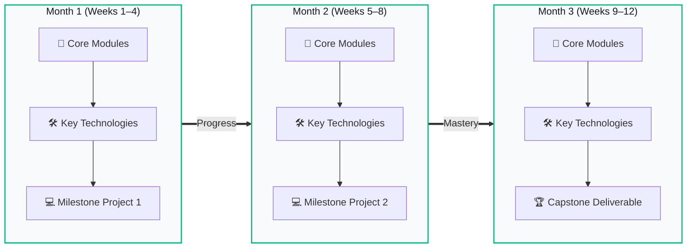

<div align="center">

  

  # 🚀 CodeCareers
  ### **Modern Tech Education & Career Bootcamps**

  *Intensive, project-based bootcamps in Web Development, Mobile Apps, and Data Science.*<br/>
  *Graduate job-ready in 3 or 6 months with verified real-world capstone projects.*

  <br/>

  [](https://developer.mozilla.org/en-US/docs/Web/HTML)
  [](https://developer.mozilla.org/en-US/docs/Web/CSS)
  [](https://developer.mozilla.org/en-US/docs/Web/JavaScript)
  [](https://tailwindcss.com/)
  [](LICENSE)

  <br/>

  [**Live Demo »**](https://ayan-multani.github.io/codecareers-website/) · [**Explore Courses »**](#-career-tracks) · [**View Curriculum »**](#-curriculum-structure) · [**Report Bug »**](https://github.com/ayan-multani/codecareers-website/issues)

</div>

---

## 📖 Table of Contents

- [✨ Overview & Highlights](#-overview--highlights)
- [🎯 Career Tracks](#-career-tracks)
- [🗺️ Static 3-Month Visual Roadmap](#-static-3-month-visual-roadmap)
- [🛠️ Complete Technology Ecosystem](#-complete-technology-ecosystem)
- [📊 3-Track Program Comparison](#-3-track-program-comparison)
- [📐 Engineering & Architectural Principles](#-engineering--architectural-principles)
- [📂 Project Directory Structure](#-project-directory-structure)
- [⚡ Quickstart & Local Setup](#-quickstart--local-setup)
- [🎨 Design System & Palette](#-design-system--palette)
- [📄 License](#-license)

---

## ✨ Overview & Highlights

**CodeCareers** is a single-page course brochure website built with modern frontend engineering practices. It provides prospective students with a visual, transparent breakdown of modern developer bootcamps.

- 🌓 **Zero-Flicker Dark / Light Mode**: LocalStorage-persisted theme toggle with custom CSS tokens.
- 🗺️ **Static 3-Month Visual Roadmap**: 3-column progression (`Month 1` ➔ `Month 2` ➔ `Month 3`) showing core modules, weekly milestones, SVG tech strips, and macOS-style project deliverables.
- ⚡ **Interactive Track & Level Deep Links**: Clicking any `3 Months` or `6 Months` button on course cards automatically switches curriculum tabs and smoothly scrolls directly to the syllabus.
- 🧰 **48+ Technology Ecosystem**: Filterable technology showcase categorizing Frontend, Backend, Databases, Mobile, AI Dev Tools, and Cloud Deployments.
- 📱 **Mobile-First Responsive Layout**: Adaptive typography, touch-optimized horizontal scroll tables, and a slide-down mobile navigation drawer.
- 📦 **100% DRY, KISS, and SOC**: Pure vanilla architecture with decoupled JSON data (`content.json`), CSS token styles (`styles.css`), and JavaScript rendering (`script.js`).

---

## 🎯 Career Tracks

<table>
  <tr>
    <td width="33%" align="center">
      <h3>🌐 Full-Stack Web</h3>
      <p><em>Frontend foundations to full-stack production SaaS applications.</em></p>
      <hr/>
      <b>3-Month Tier:</b> Frontend Web Developer<br/>
      <b>6-Month Tier:</b> Full-Stack Web Developer<br/>
      <sub>React · Next.js · Node.js · PostgreSQL · Prisma · Docker</sub>
    </td>
    <td width="33%" align="center">
      <h3>📱 Mobile App Dev</h3>
      <p><em>Cross-platform iOS & Android engineering with Flutter & Dart.</em></p>
      <hr/>
      <b>3-Month Tier:</b> Flutter Mobile Developer<br/>
      <b>6-Month Tier:</b> Full-Stack Mobile Developer<br/>
      <sub>Dart · Flutter · Firebase · PostgreSQL · SQLite · Play Store</sub>
    </td>
    <td width="33%" align="center">
      <h3>📊 Data Science & ML</h3>
      <p><em>From raw datasets and business analytics to predictive machine learning.</em></p>
      <hr/>
      <b>3-Month Tier:</b> Data Analyst / Foundation<br/>
      <b>6-Month Tier:</b> Data Scientist / ML Engineer<br/>
      <sub>Python · SQL · Pandas · FastAPI · Scikit-Learn · RAG / LLMs</sub>
    </td>
  </tr>
</table>

---

## 🗺️ Static 3-Month Visual Roadmap

Every program track features a **3-Column Static Roadmap** that outlines the exact journey from day one to capstone graduation:



---

## 🛠️ Complete Technology Ecosystem

The website features an interactive catalog of **48 authentic industry SVG icons** categorized by layer:

| Domain | Technologies Covered |
|---|---|
| **Frontend & UI** | `HTML5`, `CSS3`, `JavaScript (ES6+)`, `TypeScript`, `React`, `Next.js`, `Vite`, `Tailwind CSS` |
| **Backend & APIs** | `Node.js`, `Express`, `NestJS`, `Python`, `FastAPI`, `Pydantic`, `Swagger / OpenAPI` |
| **Database & Storage** | `PostgreSQL`, `SQLite`, `Redis`, `Prisma ORM`, `SQLAlchemy`, `SQLModel`, `Supabase`, `Firebase` |
| **Mobile Development** | `Flutter`, `Dart`, `Android Studio`, `Google Play Console` |
| **AI & Developer Tools** | `Claude`, `ChatGPT`, `Gemini`, `Google AI Studio`, `Cursor AI`, `Google Antigravity`, `v0`, `Bolt.new`, `Lovable`, `Replit`, `Kiro` |
| **Cloud & Deployment** | `Git`, `GitHub`, `GitHub Actions (CI/CD)`, `Docker`, `Vercel`, `Netlify`, `Railway`, `Render`, `Cloudflare`, `VS Code` |

---

## 📊 3-Track Program Comparison

The platform includes a transparent side-by-side comparison matrix:

| Evaluation Metric | Full-Stack Web Development | Mobile App Development | Data Science & Analytics |
|---|---|---|---|
| **Core Focus** | Frontend & Full-Stack Web Apps | Cross-Platform Flutter Mobile Apps | Business Intelligence & Machine Learning |
| **Primary Languages** | HTML, CSS, JavaScript, TypeScript, SQL | Dart, Flutter, SQL | Python, SQL |
| **Backend Architecture** | Node.js, Express, NestJS REST APIs | Firebase BaaS / Custom FastAPI | Python APIs / FastAPI Microservices |
| **Database Engine** | PostgreSQL, Prisma ORM, Redis | SQLite (Local), PostgreSQL, Supabase | SQLite, PostgreSQL, SQLAlchemy |
| **AI Engineering** | Claude, Gemini, RAG, AI APIs | Google AI Studio, AI-Powered Features | LLMs, Vector Embeddings, RAG Pipelines |
| **DevOps & Release** | Docker, GitHub Actions, Vercel, Render | Play Console, App Signing, CI/CD | Docker, CI/CD, Containerized ML APIs |
| **Final Capstone** | Full-Stack SaaS Production Application | Published Real-Time Mobile Application | Deployed Predictive ML Model API |

---

## 📐 Engineering & Architectural Principles

Built following **Senior Software Engineering Standards**:

- **DRY (Don't Repeat Yourself)**: All courses, curriculum months, technologies, and comparison data are centralized inside [`content.json`](content.json). The UI renders dynamically through clean DOM utility builders.
- **KISS (Keep It Simple, Stupid)**: No heavyweight frontend frameworks or complex build steps needed. Runs natively in any browser with zero bundle overhead.
- **SOC (Separation of Concerns)**:
  - Structure & Semantics: [`index.html`](index.html)
  - Layout & Design System Tokens: [`styles.css`](styles.css)
  - Dynamic State & Interactions: [`script.js`](script.js)
  - Data & Program Catalog: [`content.json`](content.json)
- **Zero Unicode Emojis as UI Icons**: Replaced entirely with crisp, scalable vector SVG assets for a professional corporate aesthetic.

---

## 📂 Project Directory Structure

```plaintext
codecareers-website/
├── assets/
│   └── icons/              # 48 Authentic SVG technology and tool icons
├── content.json            # Single source of truth for curriculum and comparison matrix
├── favicon.svg             # Crisp Emerald brand icon (</>)
├── index.html              # Semantic HTML5 layout with mobile menu drawer
├── script.js               # State manager, theme toggle, roadmap & ecosystem renderers
├── styles.css              # Custom CSS design system, dark mode tokens & responsive queries
└── README.md               # Project documentation
```

---

## ⚡ Quickstart & Local Setup

### Option 1: Live Server / VS Code Extension
1. Clone the repository:
   ```bash
   git clone https://github.com/ayan-multani/codecareers-website.git
   cd codecareers-website
   ```
2. Open in VS Code:
   ```bash
   code .
   ```
3. Right-click [`index.html`](index.html) and select **"Open with Live Server"**.

### Option 2: Node.js `serve` / `npx`
Run directly from your terminal:
```bash
npx -y serve . --listen 3000
```
Open [http://localhost:3000](http://localhost:3000) in your web browser.

---

## 🎨 Design System & Palette

| Token | Light Mode Hex | Dark Mode Hex | Usage |
|---|---|---|---|
| **Primary Accent** | `#10B981` | `#10B981` | Emerald branding, active states, badges |
| **Accent Hover** | `#059669` | `#34D399` | Button hover & highlights |
| **Background** | `#F8FAFC` | `#030712` | Page canvas background |
| **Surface Card** | `#FFFFFF` | `#0D1117` | Card background, macOS windows |
| **Border Soft** | `#E2E8F0` | `#162030` | Separators, table cells |
| **Text Primary** | `#0F172A` | `#F1F5F9` | Headings & primary body |
| **Text Muted** | `#64748B` | `#94A3B8` | Subtitles, meta tags |

---

## 📄 License

Distributed under the **MIT License**. See `LICENSE` for more information.

<br/>

<div align="center">
  <sub>Designed & Developed with ❤️ for aspiring software engineers.</sub>
</div>
